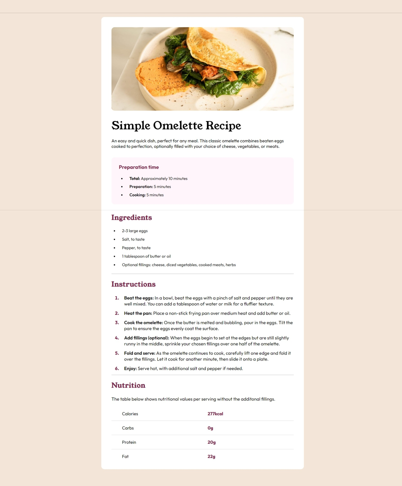

# Frontend Mentor - Recipe page solution

This is a solution to the [Recipe page challenge on Frontend Mentor](https://www.frontendmentor.io/challenges/recipe-page-KiTsR8QQKm). Frontend Mentor challenges help you improve your coding skills by building realistic projects.

## Table of contents

- [Overview](#overview)
  - [The challenge](#the-challenge)
  - [Screenshot](#screenshot)
  - [Links](#links)
- [My process](#my-process)
  - [Built with](#built-with)
  - [What I learned](#what-i-learned)
  - [Continued development](#continued-development)
  - [Useful resources](#useful-resources)
- [Author](#author)
- [Acknowledgments](#acknowledgments)

## Overview

The challenge was to recreate a recipe page from scratch. I do not have a pro account, thus I did not have access to any Figma files. I was given two screenshots of the final page: one mobile and one desktop. I was supplied the image, as well as the color pallete.

### Screenshot



### Links

- Solution URL: (https://horoserp.github.io/recipe)
- Live Site URL: (https://horoserp.github.io/recipe)

## My process

- I began by creating the individual components and applying styles to them one by one.
- Next I ensured mobile responsiveness by adding media queries.
- Finally, I deployed the page to GitHub Pages.

### Built with

- Semantic HTML5 markup
- CSS custom properties
- Flexbox
- [React](https://reactjs.org/) - JS library

### What I learned

The largest learning point I encountered during this reconstruction involved properly formatting
the bullet points (markers) in the "Preperation Time" section while on a small screen. I ended up resolving this challenge doing the following:

- Changing the li elements to display flex and setting align-items to center.
- Adding a before psedo-selector to the li where I set the content to empty, added a box which I turned into a circle with border-radius, and then set a margin.

```css
.prep li {
  padding: 0;
  margin-bottom: 10px;
  line-height: 1.3;
  display: flex;
  align-items: center;
}

.prep li::before {
  content: "";
  width: 0.35rem;
  height: 0.35rem;
  border-radius: 50%;
  background: black;
  margin: 0 2.25rem 0 0.5rem;
}
```

### Continued development

I would like to decrease my time spent on responsiveness by getting better acquainted with media queries and responsiveness in general.

### Useful resources

- [W3Schools](https://www.w3schools.com/) - This is a great reference site which helped me remember some of the required syntax and generalities surrounding the base of a react project.
- [Stack Overflow](https://stackoverflow.com/) - This is an excellent resource for finding answers to precise questions. I used it multiple times during this challenge.

## Author

- Website - [Robert P. Horosewski](https://horoserp.github.io/React-Portfolio)
- Frontend Mentor - [@horoserp](https://www.frontendmentor.io/profile/horoserp)
- LinkedIn - [Robert P. Horosewski](https://www.linkedin.com/in/robert-horosewski-8a0608196/)

## Acknowledgments

Thanks to my wife for the encouragement to pursue my dream.
